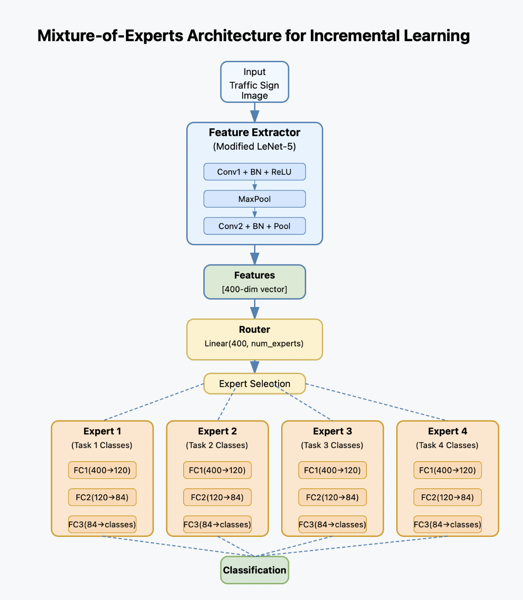

# Incremental Learning with Mixture-of-Experts (MoE)
[](https://pytorch.org/)
[](https://opensource.org/licenses/MIT)
[](https://benchmark.ini.rub.de/gtsrb_dataset.html)

## 📚 Overview

This repository implements a scalable incremental learning system that combats catastrophic forgetting using a Mixture-of-Experts (MoE) approach with an improved LeNet-5 architecture. The system learns to classify traffic signs sequentially without forgetting previously learned classes, evaluated on the German Traffic Sign Recognition Benchmark (GTSRB).

<p align="center">
  
  <br>
  <em>Architecture of the Mixture-of-Experts model with LeNet-5 feature extractor</em>
</p>

## 🔍 Problem Statement

**Catastrophic forgetting** is a fundamental challenge in machine learning where neural networks tend to forget previously learned information when trained on new data. Traditional approaches require retraining on all data, which becomes computationally expensive as datasets grow.

Our approach tackles this by:
- 🏗️ Employing a modular architecture that adds experts for new tasks
- 🔄 Preserving a frozen feature extractor to maintain learned representations
- 🧠 Using a memory buffer to retain examples from previous tasks
- 🧭 Implementing a router mechanism to direct inputs to the appropriate expert

## 🏛️ Model Architecture

### Feature Extractor
- Based on LeNet-5 with improvements (BatchNorm, Dropout)
- Processes RGB images (32×32 pixels)
- Extracts 400-dimensional feature vectors
- Frozen after initial training to preserve representations

```python
class LeNetFeatureExtractor(nn.Module):
    def __init__(self, in_channels=3):
        super(LeNetFeatureExtractor, self).__init__()
        self.conv1 = nn.Conv2d(in_channels, 6, kernel_size=5)
        self.bn1 = nn.BatchNorm2d(6)
        self.pool = nn.MaxPool2d(2, 2)
        self.conv2 = nn.Conv2d(6, 16, kernel_size=5)
        self.bn2 = nn.BatchNorm2d(16)
    def forward(self, x):
        x = F.relu(self.conv1(x))
        x = self.bn1(x)
        x = self.pool(x)
        x = F.relu(self.conv2(x))
        x = self.bn2(x)
        x = self.pool(x)
        return x.view(x.size(0), -1)  # [B, 400]
```

### Expert Networks
- Task-specific networks responsible for their subset of classes
- Each expert includes:
  - Two fully-connected layers (400→120→84)
  - Dropout for regularization
  - Output layer sized according to the number of classes

```python
class LeNetExpert(nn.Module):
    def __init__(self, feature_dim, num_classes):
        super(LeNetExpert, self).__init__()
        self.fc1 = nn.Linear(feature_dim, 120)
        self.dropout1 = nn.Dropout(0.5)
        self.fc2 = nn.Linear(120, 84)
        self.dropout2 = nn.Dropout(0.5)
        self.fc3 = nn.Linear(84, num_classes)
    def forward(self, x):
        x = F.relu(self.fc1(x))
        x = self.dropout1(x)
        x = F.relu(self.fc2(x))
        x = self.dropout2(x)
        return self.fc3(x)
```

### Router Network
- Linear layer that maps feature vectors to expert selection logits
- Selects the most appropriate expert for a given input
- Trained with cross-entropy loss to align with ground truth expert assignments

```python
# Router implementation within the MixtureOfExperts class
def add_expert(self, new_class_indices):
    num_new_classes = len(new_class_indices)
    new_expert = LeNetExpert(self.feature_dim, num_new_classes)
    self.experts.append(new_expert)
    self.expert_classes.append(new_class_indices)
    new_num_experts = len(self.experts)
    
    # Router network is a linear layer mapping features to expert logits
    old_router = self.router
    new_router = nn.Linear(self.feature_dim, new_num_experts)
    
    # Transfer weights from old router to maintain previous routing behavior
    if old_router is not None:
        with torch.no_grad():
            new_router.weight[:old_router.out_features] = old_router.weight
            new_router.bias[:old_router.out_features] = old_router.bias
    self.router = new_router
```

## 🔄 Incremental Learning Process

### Task Division
The GTSRB dataset is divided into 4 sequential tasks, with each introducing new traffic sign classes:
- Task 1: Classes 0-10
- Task 2: Classes 11-21
- Task 3: Classes 22-32
- Task 4: Classes 33-42

### Training Procedure
1. **First Task**: Train feature extractor and first expert (120 epochs)
2. **Subsequent Tasks**:
   - Freeze feature extractor and previous experts
   - Add new expert for current task classes
   - Train for 80 epochs with constant learning rate (0.001)
   - Incorporate memory buffer containing examples from previous tasks
   - Apply multi-component loss function:
     - Classification loss on new task data
     - Classification loss on memory buffer (weighted by 2.0)
     - Routing alignment loss (weighted by 0.1)
   - Save best model checkpoint based on validation accuracy

### Memory Buffer Strategy
- Maintains 1000 samples from previous tasks 
- Balanced allocation across past classes
- Randomly selected from test split to simulate real-world scenarios
- Replayed during training to mitigate forgetting

## 📊 Results

The incremental learning performance demonstrates the model's ability to learn new tasks while retaining knowledge from previous ones:

| Task | Classes | Accuracy |
|------|---------|----------|
| 1    | 0-10    | 83.26%   |
| 2    | 0-21    | 82.94%   |
| 3    | 0-32    | 75.74%   |
| 4    | 0-42    | 75.84%   |

While there is some performance degradation as new tasks are added, the model maintains a respectable accuracy across all classes, demonstrating effective mitigation of catastrophic forgetting.

### Training Variability and Error Analysis

Performance can vary significantly between training runs due to several factors:

- The quality of the initial feature extractor training has a cascading effect on all subsequent tasks
- Each time a new expert is added, the router is retrained, which can lead to degradation in routing performance
- These training path dependencies can result in different convergence points and final performance metrics

A potential solution to this challenge would be to train multiple models for each task and select the best combination of feature extractor, router, and experts incrementally.

### Detailed Error Analysis

Advanced error analysis from our `inference_advanced.py` script provides insights into the specific sources of classification errors:

```
Total Samples: 12630
Router Errors: 1825 (14.45%)
Expert Errors (on correctly routed samples): 1227 (11.36%)
Per-Expert Statistics:
  Expert 0: 4796 samples, 727 errors, error rate: 15.16%
  Expert 1: 2633 samples, 151 errors, error rate: 5.73%
  Expert 2: 1587 samples, 263 errors, error rate: 16.57%
  Expert 3: 1789 samples, 86 errors, error rate: 4.81%
```

This breakdown reveals that:
- ~14.5% of errors occur during the routing stage (selecting the wrong expert)
- ~11.4% of errors occur within experts (correct expert selected but wrong class predicted)
- Error rates vary significantly between experts, with Expert 1 and Expert 3 showing much lower error rates than Experts 0 and 2

These insights can guide future improvements to the model architecture and training strategy.

## 🗂️ Directory Structure

```
incremental-learning/
├── MOE_Lenet.py          # Training script implementing incremental learning with MoE
├── inference_Lenet.py    # Basic inference script for evaluating the trained MoE model
├── inference_advanced.py # Advanced inference with detailed error statistics
├── architecture.png      # Visualization of the model architecture
└── checkpoints/          # Directory containing model checkpoints
    ├── moe_model_task1.pt
    ├── moe_model_task2.pt
    ├── moe_model_task3.pt
    └── moe_model_task4.pt
```

## 🛠️ Requirements

```
torch>=1.10.0
torchvision>=0.11.0
numpy>=1.19.5
pandas>=1.3.0
matplotlib>=3.4.0
pillow>=8.2.0
tqdm>=4.60.0
```

## 🚀 How to Run

### Setup
```bash
# Clone repository
git clone https://github.com/username/incremental-learning-moe.git
cd incremental-learning-moe

# Install dependencies
pip install -r requirements.txt
```

### Training
```bash
# Run training script
python MOE_Lenet.py
```
Training creates checkpoints in the `checkpoints/` directory after completing each task.

### Inference
```bash
# Run basic inference (by default uses the task 4 model)
python inference_Lenet.py

# Run detailed error analysis
python inference_advanced.py

# Specify a different checkpoint
python inference_Lenet.py --checkpoint ./checkpoints/moe_model_task3.pt
```

## 📝 Implementation Details

Key hyperparameters:
- Learning rate: 0.001 (constant)
- Batch size: 64
- Memory buffer size: 1000 samples
- Alignment strength: 0.1
- Buffer weight: 2.0

### Loss Function Components and Justification

The loss function is carefully designed to balance learning new tasks while preserving knowledge of previous tasks:

```python
total_loss = (classification_loss_new +
              buffer_weight * classification_loss_buf +
              alignment_strength * (routing_loss_new + routing_loss_buf))
```

#### Component Justification

1. **Classification Loss for New Task** (`classification_loss_new`)
   - Standard cross-entropy loss that ensures the model learns to classify samples from the current task
   - Base component with weight 1.0 as the primary learning objective

2. **Buffer Classification Loss** (`classification_loss_buf` with weight 2.0)
   - Cross-entropy loss applied to memory buffer samples from previous tasks
   - **Weight = 2.0**: This higher weight emphasizes retaining previously learned knowledge
   - Directly combats catastrophic forgetting by forcing the model to maintain performance on past examples
   - The 2.0 weighting was empirically determined to provide optimal balance between stability (preserving old knowledge) and plasticity (acquiring new knowledge)
   - Lower weights (e.g., 1.0) led to more forgetting, while higher weights (e.g., 3.0+) hindered the learning of new tasks

3. **Routing Alignment Loss** (`routing_loss_new + routing_loss_buf` with weight 0.1)
   - Cross-entropy loss that trains the router to correctly select the appropriate expert for each sample
   - **Weight = 0.1**: This lower weight ensures routing learning occurs without dominating the classification objectives
   - This component is crucial for the MoE architecture as it ensures:
     - New samples are routed to the appropriate task-specific expert
     - Previously learned routing paths are maintained for old task samples
     - The modular structure of knowledge is preserved across incremental learning

#### How This Loss Function Mitigates Catastrophic Forgetting

The loss function addresses catastrophic forgetting through multiple mechanisms:

1. **Knowledge Preservation via Replay**
   - The weighted buffer loss ensures the model maintains performance on a subset of previous tasks
   - The increased weight (2.0) compensates for the smaller representation of past tasks in the training batches

2. **Task Separation via Expert Specialization**
   - The routing loss (0.1) maintains clear boundaries between task-specific experts
   - This separation prevents interference between tasks that would lead to forgetting

3. **Balanced Optimization**
   - The carefully tuned weight ratio (1.0 : 2.0 : 0.1) creates an optimal balance between:
     - Learning new task information
     - Preserving previous task knowledge
     - Maintaining proper task routing

4. **Architectural Protection**
   - Beyond the loss function, the freezing of the feature extractor after the first task preserves the foundational representations
   - The frozen previous experts act as knowledge preservation mechanisms, with their weights protected from catastrophic interference

The combination of these mechanisms creates a system that effectively mitigates catastrophic forgetting while maintaining the ability to learn new information incrementally.
## 🔮 Future Work

- 🧪 Experiment with different router mechanisms that improve expert selection
- 🔍 Explore distillation methods to further reduce forgetting
- 📈 Apply to larger, more complex datasets (ImageNet, etc.)
- 🔄 Implement ensemble strategies to reduce training path dependence
- 🤖 Develop improved memory buffer selection strategies

## 📚 References

- German Traffic Sign Recognition Benchmark (GTSRB): https://benchmark.ini.rub.de/gtsrb_dataset.html
- "Overcoming catastrophic forgetting in neural networks" by Kirkpatrick et al.
- "Mixture of Experts: A Literature Survey" by Masoudnia and Ebrahimpour

## 🙏 Acknowledgements

This project leverages several key resources:
- GTSRB Dataset for training and evaluation
- PyTorch framework for implementation
- Research contributions from the incremental learning and MoE communities

## 📄 License

This project is licensed under the MIT License - see the LICENSE file for details.
